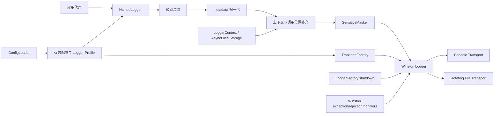
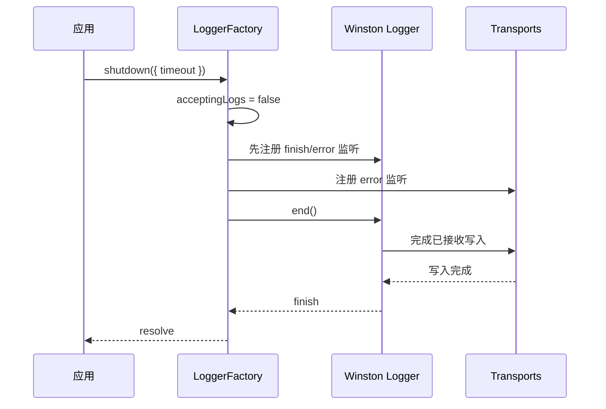

# @jintianxiayu/logger 基础版设计文档

> 文档状态：基础版实现设计
> 需求基线：`README.md`
> 设计目标：把需求稿转换为可实现、可测试的内部设计，不扩展日志队列、自动信号处理、多工厂或远程投递能力。

## 1. 设计范围

本设计覆盖以下能力：

- 进程级单例 `LoggerFactory` 与命名 Logger。
- 配置对象或 YAML 配置加载、校验、root 默认值及 named logger 深度继承。
- Console 与按日期轮转的 File 输出。
- Plain pattern 与单行 JSON 格式。
- metadata 归一化、Error 转换与安全序列化。
- 结构化 metadata 的递归脱敏。
- 基于 `AsyncLocalStorage` 的请求上下文。
- Winston 原生 `uncaughtException` / `unhandledRejection` 处理。
- 显式 `shutdown()` 及有限等待。

以下内容明确不进入基础版：

- 自定义日志队列、背压、重试、丢弃策略或 exactly-once。
- `setupShutdownHandlers()`、SIGINT/SIGTERM 监听器或应用退出编排。
- 自定义 `process.on('uncaughtException')` / `process.on('unhandledRejection')` 状态机。
- 配置热更新、多套 LoggerFactory、跨进程文件协调。
- message、Error message 或 stack 的自由文本秘密扫描。
- 第三方日志平台 SDK。

## 2. 需求追踪

| 编号 | 需求                           | 主要设计点                                   | 验证位置 |
| ---- | ------------------------------ | -------------------------------------------- | -------- |
| R1   | 命名 Logger 与实例复用         | `NamedLogger` 缓存、精确名称匹配             | T1、T2   |
| R2   | 配置对象、YAML、默认配置与继承 | `ConfigLoader`、来源选择、模式校验、深度合并 | T3～T6   |
| R3   | Plain/JSON、Console/File       | 事件管线、transport 路由、格式器             | T7～T12  |
| R4   | metadata 与 Error              | `MetadataNormalizer`、安全序列化             | T13～T16 |
| R5   | 结构化脱敏                     | `SensitiveMasker` 在 transport 前执行        | T17～T21 |
| R6   | traceId 异步上下文             | `LoggerContext.withContext/get`              | T22～T25 |
| R7   | 进程异常                       | root transport 的 Winston 原生 handler       | T26～T28 |
| R8   | 显式关闭                       | `end()`、`finish`、error、timeout            | T29～T32 |

当本文与需求基线冲突时，以 `README.md` 为准；应先修订需求，再调整设计和实现。

## 3. 总体架构



设计采用一个进程级 Winston Logger 作为内部写入入口，命名 Logger 只是轻量适配器。每次事件携带对应的有效配置 profile，由 transport 的过滤/格式化阶段决定是否输出以及使用 Plain 还是 JSON。

选择单一内部写入入口的原因：

- `init()` 不会因创建多个命名 Logger 而重复注册进程异常 handler。
- `shutdown()` 只需关闭一个 Winston Logger，完成条件清楚。
- 相同 Console 或 File 目标不会因为 Logger 名称不同而无条件重复写入。
- named logger 的级别仍在进入昂贵处理前独立判断。

基础版不实现可替换容器或多实例协调。

## 4. 公共 API

### 4.1 LoggerFactory

```typescript
interface ShutdownOptions {
    timeout?: number;
}

class LoggerFactory {
    static init(source?: string | LoggerConfig): void;
    static getLogger(name: string): LoggerInterface;
    static shutdown(options?: ShutdownOptions): Promise<void>;
}
```

约束：

- `init(source?)` 同步选择、加载并验证配置；`source` 为 YAML 路径或本库的 `LoggerConfig` 对象。
- 显式 `source` 优先于 `LOGGER_CONFIG_PATH`；两者都未指定时使用内置默认配置。
- 首次初始化成功后配置来源即固定；重复调用 `init()` 幂等返回，不重新加载或替换配置。
- `getLogger()` 在尚未初始化时同步触发一次懒初始化。
- `name` 必须是去除首尾空白后的非空字符串；缓存和配置匹配使用该规范化名称。
- 同一名称始终返回同一 `LoggerInterface` 实例。
- `shutdown()` 开始后不再把新事件交给 Winston；迟到的日志调用直接返回，不抛错。
- 多次 `shutdown()` 返回同一个进行中或已完成的 Promise。
- 未初始化时调用 `shutdown()` 直接完成，不为关闭动作创建 transport。

Logger 名称应使用有限、稳定的模块名，例如 `http`、`database`。不得把 requestId、userId 等高基数字段用作 Logger 名称；这些值应放入 metadata 或 `LoggerContext`。

### 4.2 LoggerInterface

```typescript
interface LoggerInterface {
    debug(message: string, ...meta: unknown[]): void;
    info(message: string, ...meta: unknown[]): void;
    warn(message: string, ...meta: unknown[]): void;
    error(message: string, ...meta: unknown[]): void;
}
```

Logger 适配器只保存名称和 profile 引用，不直接持有 transport。

### 4.3 LoggerContext

```typescript
type ContextValues = Readonly<Record<string, unknown>>;

class LoggerContext {
    static withContext<T>(values: ContextValues, fn: () => T): T;
    static get<T = unknown>(key: string): T | undefined;
}
```

公共 API 只保留 `withContext()` 和 `get()`。不暴露 `set()`、`clear()`、`getStore()`、`enterWith()` 或 `disable()`。

## 5. 生命周期

内部只需要四个状态：

```text
UNINITIALIZED -> ACTIVE -> CLOSING -> CLOSED
```

| 当前状态      | `init(source?)` | `getLogger()`      | 日志写入 | `shutdown()`           |
| ------------- | --------------- | ------------------ | -------- | ---------------------- |
| UNINITIALIZED | 初始化          | 初始化后返回       | 不适用   | 直接完成并进入 CLOSED  |
| ACTIVE        | 幂等返回        | 返回缓存或新适配器 | 接受     | 进入 CLOSING           |
| CLOSING       | 抛生命周期错误  | 抛生命周期错误     | 不再转发 | 返回同一 Promise       |
| CLOSED        | 抛生命周期错误  | 抛生命周期错误     | 不再转发 | 返回同一已完成 Promise |

`acceptingLogs` 必须在调用 Winston `end()` 之前置为 `false`，避免关闭过程中产生 write-after-end。

## 6. 配置设计

### 6.1 加载顺序

```text
配置来源选择（只选择一个）：
init(config 对象或 configPath) > LOGGER_CONFIG_PATH > 空配置对象

选中的配置文档
    -> 覆盖内置默认配置的 root
    -> 指定名称的 logger 覆盖
    -> 生成不可变 EffectiveLoggerProfile
```

- `init(config)` 直接把对象交给 schema 校验和规范化流程，不读取配置文件或 `LOGGER_CONFIG_PATH`。
- `init(configPath)` 只读取该路径，不读取 `LOGGER_CONFIG_PATH`。
- `init()` 未传参数时才读取 `LOGGER_CONFIG_PATH`；环境变量也未设置时使用空配置文档，从而得到内置默认配置。
- 选中的路径为空、文件不存在、不可读、YAML 非法，或对象/文件字段非法时，都同步抛出 `LoggerConfigError`，不回退到下一来源。
- 显式路径、环境变量路径和配置中的相对 `file.dirname` 均以 `process.cwd()` 为基准。
- 配置只加载一次；Loader 不保留文件 watcher。
- 配置对象和外部 YAML 都可以只给出需要覆盖的字段，其余取内置默认值。
- `masking` 与 `processErrors` 在全局层合并，不能出现在 named logger 中。

### 6.2 概念数据结构

```typescript
interface LoggerConfig {
    root?: Partial<LoggerOptions>;
    loggers?: Record<string, Partial<LoggerOptions>>;
    masking?: Partial<SensitiveMaskingConfig>;
    processErrors?: Partial<ProcessErrorConfig>;
}

interface LoggerOptions {
    level: 'debug' | 'info' | 'warn' | 'error';
    captureLogPosition: boolean;
    console: ConsoleConfig;
    file: FileConfig;
}

interface ConsoleConfig {
    enabled: boolean;
    colors: boolean;
    format: 'plain' | 'json';
    pattern: string;
}

interface FileConfig {
    enabled: boolean;
    format: 'plain' | 'json';
    pattern: string;
    dirname?: string;
    filename?: string;
    datePattern?: string;
    maxSize?: number | string;
    maxFiles?: number | string;
}

interface ProcessErrorConfig {
    uncaughtException: boolean;
    unhandledRejection: boolean;
    exitOnError: boolean;
}
```

这些是设计模型；最终导出类型以 `README.md` 的公共类型清单为准。

### 6.3 合并规则

合并器按已知 schema 逐字段复制，不对任意对象执行通用递归赋值：

- `undefined` 表示未配置，继承上一层。
- `false`、`0` 和空字符串不会被 truthy 判断误判为缺失；不允许空字符串的字段由校验器拒绝。
- `console` 和 `file` 分别深度合并。
- `console.pattern` 与 `file.pattern` 分别归属于对应 transport，不存在 profile 级共享 pattern。
- logger 名称使用 `Map` 存储并精确匹配。
- 不读取继承属性，也不接受 `__proto__` 等 schema 外字段。
- 有效 profile 创建后冻结，运行期不再改变。

### 6.4 校验

初始化阶段至少校验：

- 根节点、`root`、`loggers`、`masking`、`processErrors` 的类型正确。
- 只接受声明过的字段；错误包含配置路径和字段路径，但不回显完整配置内容。
- level、format 为支持的枚举。
- 启用 File 时，`dirname`、`filename` 和轮转参数满足所选 transport adapter 的约束。
- `timeout`、`maxSize`、`maxFiles` 等数值语义为正值。
- 有效格式为 Plain 的 transport，其 pattern 只包含受支持占位符；JSON transport 不使用也不校验占位符。
- 自定义脱敏模板只包含受支持 token。
- 启用任一 `processErrors` 选项时，root 至少启用一个 transport，否则初始化失败，避免形成“已开启但无输出目标”的假象。

按日期轮转通过一个 Winston-compatible File transport adapter 实现。`datePattern`、`maxSize`、`maxFiles` 是本库配置契约，不把具体第三方 transport 的类或选项类型暴露为公共 API；实现前应锁定依赖版本，并用集成测试验证三项映射及 transport `error` 事件。

## 7. NamedLogger 与事件管线

每个日志方法按以下顺序执行：

```text
1. 检查 Factory 是否仍接受日志
2. 按该 Logger 的有效 level 过滤
3. 归一化 metadata
4. 生成 timestamp、name 和 traceId
5. 仅在 `captureLogPosition` 开启且至少一个已启用 transport 会输出位置时捕获一次 log_position
6. 克隆并脱敏 metadata
7. 把安全事件交给 Winston
8. 各 transport 过滤并完成 Plain/JSON 格式化
```

级别过滤必须在调用栈解析、深拷贝和序列化之前完成。

内部事件模型：

```typescript
interface SafeLogEvent {
    timestamp: string;
    level: 'debug' | 'info' | 'warn' | 'error';
    name: string;
    message: string;
    traceId?: string;
    logPosition?: string;
    meta?: unknown;
    // 使用内部 Symbol 关联 profile，不进入最终输出。
}
```

传给 Winston 的事件中不得保留未脱敏 metadata 的引用。

### 7.1 Transport 路由

- Console transport 根据事件 profile 的 `console.enabled` 决定是否输出。
- File transport 根据事件 profile 的 `file.enabled` 和目标文件配置决定是否输出。
- transport 的 `format` 根据事件 profile 选择 Plain 或 JSON。
- Plain transport 使用自身配置中的 pattern 完成渲染；Console 与 File 的 pattern 彼此独立。
- 内部 Winston Logger 使用覆盖四个公共级别的最低阈值；真正的 named level 已在步骤 2 判断。
- Winston 原生生成、没有 profile 标记的异常事件回退到 root profile。

同一物理文件目标应只创建一个轮转 writer。若多个 profile 指向同一文件，格式由事件 profile 决定；因此配置者不应在同一文件中混用 Plain 和 JSON。实现可在初始化时对这种混用给出配置错误，以保证文件始终是单一格式。

## 8. Metadata 归一化与序列化

### 8.1 参数映射

| 调用                              | 事件中的 metadata                    |
| --------------------------------- | ------------------------------------ |
| `logger.info('m')`                | 不包含 `meta`                        |
| `logger.info('m', { a: 1 })`      | `meta = { a: 1 }`                    |
| `logger.info('m', 1)`             | `meta = { args: [1] }`               |
| `logger.info('m', { a: 1 }, 'x')` | `meta = { args: [{ a: 1 }, 'x'] }`   |
| `logger.error('m', error)`        | `meta = { args: [normalizedError] }` |

“普通对象”指原型为 `Object.prototype` 或 `null` 的非数组对象；`Error`、数组、Date 等单参数按 `meta.args` 处理。

### 8.2 Error 转换

任意层级遇到 `Error` 时转换为至少包含以下字段的普通对象：

```typescript
{
    name: error.name,
    message: error.message,
    stack: error.stack
}
```

Error 的可枚举自定义属性在完成递归归一化和脱敏后可以保留，但不能覆盖这三个标准字段。

### 8.3 失败隔离

序列化不能中断业务调用：

- 递归遍历使用访问栈检测循环引用，循环位置替换为 `[Circular]`。
- BigInt 等 JSON 不直接支持的值转换为明确字符串表示。
- getter、Proxy 或 formatter 抛错时，整段 meta 替换为 `{"serializationError":"[Unserializable metadata]"}`。
- stderr 只输出固定诊断码和错误类型，不打印 Logger 名称或原 metadata，且不得再次调用本日志库。
- JSON stringify 外层仍有最终 `try/catch`，保证每次输出都是一行合法 JSON 或固定的安全降级事件。

## 9. 输出格式

### 9.1 PlainFormat

每个有效格式为 Plain 的具体 transport 在初始化时把自己的 pattern 编译为 token 序列。运行时只替换这些 token：

- `timestamp`
- `level`
- `name`
- `traceId`
- `log_position`
- `message`
- `meta`

未知 token 在初始化时抛配置错误。替换只作用于 pattern 本身，不再次解析 message 或 metadata 中出现的 `%{...}`。有效格式为 JSON 的 transport 忽略 pattern，不编译其 token。

缺省值：

- 无 traceId：`-`。
- 无 metadata：`-`。
- 无法确定调用位置：`-`。

pattern 是该 Plain transport 的完整输出契约。`captureLogPosition` 开启时，只有 pattern 包含 `%{log_position}` 才按占位符位置渲染；不包含时不输出位置，也不自动追加任何后缀。关闭时不解析调用栈，pattern 中已有的 `%{log_position}` 渲染为 `-`。

`console.colors` 默认值为 `false`。ANSI 颜色只允许出现在 `console.format=plain` 且显式配置 `console.colors=true` 的最终字符串中；JSON 和 File 输出不加入颜色码。

### 9.2 JsonFormat

每条事件构造一个新对象并执行一次 `JSON.stringify`，末尾由 transport 写入换行。稳定字段为：

```json
{
    "timestamp": "...",
    "level": "info",
    "name": "http",
    "message": "...",
    "traceId": "...",
    "logPosition": "handler.ts:42",
    "meta": {}
}
```

- `traceId` 与 `meta` 不存在时省略对应字段。
- `captureLogPosition` 开启时输出 `logPosition`，关闭时省略；值固定为 `file:line`，解析失败时为 `-`。
- 调用方 metadata 永远位于 `meta` 下，不能覆盖保留字段。
- 不输出内部 profile 标记或 ANSI 控制字符。
- 不承诺 JSON 文本字段顺序；消费者必须按 JSON 字段解析。

### 9.3 LogPosition

每个有效 logger profile 提供 `captureLogPosition` 布尔配置，root 默认值为 `true`，named logger 按普通 profile 字段继承或覆盖。事件通过 level 和 transport enabled 检查后，仅在该配置开启且至少有一个已启用输出会使用位置时捕获一次调用栈：JSON transport 总会使用，Plain transport 只有自身 pattern 包含 `%{log_position}` 时才使用。同一事件的多个 transport 复用捕获结果，但各自仍按格式规则决定是否输出。

算法：

1. 创建 Error 并读取 stack。
2. 跳过 Node 内部帧和本包 LoggerFactory、NamedLogger、格式器帧。
3. 选择第一条调用方帧。
4. 输出 `file:line`，明确丢弃 column。
5. 解析失败时返回 `-`，不影响日志写入。

测试需覆盖 Windows 路径、POSIX 路径、同步调用和异步调用，并断言结果不以 `:line:column` 形式出现。

## 10. SensitiveMasker

`SensitiveMasker` 接收已归一化 metadata，返回新的安全对象：

- 对对象与数组递归复制。
- 字段名使用与 locale 无关的小写形式匹配。
- 自定义字段在同名时覆盖默认策略；大小写归一化后重复的自定义键属于配置错误。
- 命中完全隐藏策略时，整个值替换为固定掩码，不继续遍历原值。
- 部分保留策略先转成字符串；值过短或格式非法时完全隐藏，避免“仅保留四位”反而泄露全部值。
- 无论 Console 还是 File，收到的都只能是脱敏后的对象。
- `masking.enabled=false` 时仍执行安全克隆和 Error/循环归一化，但不替换敏感字段。

自定义模板在初始化时编译。支持 `{firstN}`、`{lastN}`、`{domain}` 与普通字面量；未知花括号 token 属于配置错误。

脱敏边界保持与需求一致：不扫描 message、Error message 或 stack 的自由文本。

## 11. LoggerContext

内部持有一个进程级：

```typescript
AsyncLocalStorage<Readonly<Record<string, unknown>>>;
```

`withContext(values, fn)` 的语义：

1. 读取当前 store；没有时使用空对象。
2. 创建 `{ ...parent, ...values }` 的新对象，内层同名值覆盖外层。
3. 对新 store 做浅冻结。
4. 通过 `AsyncLocalStorage.run(store, fn)` 执行并原样返回 `fn` 的同步值或 Promise。
5. `fn` 返回、抛错或 rejection 后，由 `run()` 自动恢复外层上下文。

`get(key)` 只读取当前 store；无活动上下文或键不存在时返回 `undefined`。

不使用 `enterWith()`，避免把状态延续到当前同步执行后续；不调用 `disable()`，避免清除同一实例上仍在执行的其他请求上下文。由于没有 `set()`、`clear()` 和 `getStore()`，调用方也无法原地修改或手动清理共享 store。

traceId 的长度、字符集和可信来源由应用入口的 `normalizeTraceId` 负责。日志管线只附加非空字符串类型的 traceId，其他类型按不存在处理；库负责上下文传播与输出转义，但不替代入口校验。

## 12. Winston 进程异常处理

仅 root 输出目标参与进程异常处理：

- root Console transport 按配置设置 `handleExceptions` / `handleRejections`。
- root File transport 按配置设置相同选项。
- 内部 Winston Logger 的 `exitOnError` 直接取 `processErrors.exitOnError`。
- named profile 不注册额外 handler。
- 同一 transport 不同时通过 transport flag 和 `exceptionHandlers/rejectionHandlers` 重复注册。
- 不额外调用 `process.on(...)`，异常记录和退出时序遵循 Winston。

异常事件没有 named profile 时使用 root profile 格式化。Winston 产生的异常 message/stack 属于自由文本，不做内容扫描。

进程异常行为必须在独立子进程测试；不能在测试主进程内触发。

## 13. shutdown 设计



实现规则：

1. 校验 timeout；必须是正整数，未传时使用内部常量 `5000ms`，不再增加一层 runtime 配置。
2. 在 `end()` 前注册 Logger `finish/error` 及 transport `error` 监听器。
3. 启动一个 timeout timer。
4. `finish` 先到则清理 timer 和临时监听器并 resolve。
5. Logger/transport `error` 先到则清理并 reject 原始错误。
6. timer 先到则以包含 timeout 值的 `LoggerShutdownTimeoutError` reject。
7. `end()` 同步抛错时按 error 路径结束。
8. timeout 只结束等待，不调用 `process.exit()`；退出策略由应用决定。

每个 Logger/transport 从创建时即安装最小 `error` 监听，避免 EventEmitter 的未监听 error 导致进程异常。正常运行期错误只写固定 stderr 诊断；关闭期间同一错误还会使 `shutdown()` 失败。

`finish` 只证明 Winston transports 已完成当前写入流程，不承诺文件系统落盘介质或远程采集平台已持久化。

## 14. 内部模块

建议结构：

```text
src/
├── index.ts
├── core/
│   ├── LoggerFactory.ts
│   ├── LoggerContext.ts
│   ├── ConfigLoader.ts
│   ├── MetadataNormalizer.ts
│   ├── SensitiveMasker.ts
│   └── LogPosition.ts
├── transport/
│   └── TransportFactory.ts
├── format/
│   ├── PlainFormat.ts
│   └── JsonFormat.ts
├── config/
│   └── defaultConfig.ts
└── types/
    └── index.ts
```

| 模块                     | 单一职责                                                                     |
| ------------------------ | ---------------------------------------------------------------------------- |
| LoggerFactory            | 生命周期、配置单次初始化、命名缓存、Winston 实例与关闭                       |
| LoggerContext            | AsyncLocalStorage 的 `run/get` 封装                                          |
| ConfigLoader             | 选择显式参数/环境变量/默认来源，同步读取、YAML 解析、schema 校验、继承与冻结 |
| MetadataNormalizer       | 参数映射、Error/特殊值归一化、失败降级                                       |
| SensitiveMasker          | 安全克隆、字段匹配、模板执行                                                 |
| LogPosition              | 外部调用帧定位并输出 `file:line`                                             |
| TransportFactory         | Console/File 创建、路由、Winston handler flags                               |
| PlainFormat / JsonFormat | 只处理已安全化事件的最终字符串                                               |

若实现规模很小，`MetadataNormalizer` 或 `TransportFactory` 可以合并到相邻模块；不为了目录结构创建空抽象。

## 15. 错误模型

| 错误                                          | 暴露方式                                    | 是否允许继续   |
| --------------------------------------------- | ------------------------------------------- | -------------- |
| 选中的路径不存在、YAML 非法或对象/schema 非法 | `init/getLogger` 同步抛 `LoggerConfigError` | 修正配置后重启 |
| 名称为空                                      | `getLogger` 同步抛 `TypeError`              | 可以           |
| 初始化后再次初始化                            | 幂等返回                                    | 可以           |
| CLOSING/CLOSED 后获取 Logger                  | 同步抛 `LoggerLifecycleError`               | 不可重新初始化 |
| metadata 处理失败                             | 安全占位符 + 固定 stderr                    | 可以           |
| 正常运行期 transport error                    | 固定 stderr                                 | 由应用运维处理 |
| shutdown 期间 Logger/transport error          | Promise reject                              | 应用决定退出码 |
| shutdown timeout                              | Promise reject                              | 应用决定退出码 |

错误消息不得包含原始 metadata、敏感配置值或完整环境变量内容。

## 16. 测试设计

### 16.1 配置与实例

- T1：同名返回同一对象，不同名返回不同适配器。
- T2：空白名称被拒绝，名称精确匹配。
- T3：配置来源遵循“显式参数（对象或路径）> 环境变量 > 默认配置”，相对路径以当前工作目录解析。
- T4：选中的显式/环境变量路径不存在、不可读或 YAML 非法时同步失败且不回退。
- T5：root/named 深度继承，`false` 正确保留。
- T6：YAML 与直接对象中的未知字段、未知 placeholder、非法模板都在初始化时失败。

### 16.2 输出与 metadata

- T7：Plain 每个 placeholder 的正常值和缺省值。
- T8：`captureLogPosition` 开启时 JSON 包含 `file:line`；Plain 仅在所属 pattern 含占位符时包含且不自动追加；关闭时 JSON 省略字段、Plain 占位符为 `-`，所有位置均没有 column。
- T9：Console Plain 颜色开关正确。
- T10：Console/File JSON 逐行可解析且无 ANSI。
- T11：不同 profile 的 level、enabled、format 路由正确。
- T12：日期、大小、保留期限轮转参数经过真实 File transport 集成验证。
- T13：无 meta 时省略字段。
- T14：单个普通对象直存，其他形态进入 `meta.args`。
- T15：嵌套 Error 保留 name/message/stack。
- T16：循环、BigInt、抛错 getter 不会从日志方法逸出异常。

### 16.3 安全与上下文

- T17：默认字段不区分大小写脱敏。
- T18：自定义字段覆盖默认规则。
- T19：对象、数组、Error 自定义属性递归处理。
- T20：调用方原对象及嵌套对象保持不变。
- T21：Console/File 的捕获原始输出中均不存在敏感原值。
- T22：两个并发 Promise 链的 traceId 不串线。
- T23：嵌套 `withContext` 覆盖并在结束后恢复外层值。
- T24：同步返回、Promise、throw、rejection 都保持原语义。
- T25：无上下文时 `get()` 返回 `undefined`。

### 16.4 进程与关闭

- T26：子进程 uncaughtException 写入 root transport。
- T27：子进程 unhandledRejection 写入 root transport。
- T28：分别验证 `exitOnError=true/false` 的真实进程行为且无重复日志。
- T29：慢 transport 完成后才收到 `shutdown()` resolve。
- T30：Logger error 和 transport error 均使 shutdown reject。
- T31：永不完成的测试 transport 触发 timeout。
- T32：重复 shutdown 共享结果，开始关闭后新日志不进入 transport。

生产构建只编译 `src/` 到 `dist/`；测试由 Jest 和 `ts-jest` 直接加载 TypeScript 文件，转换结果仅保存在内存中，不生成测试构建目录。测试文件和日志输出使用临时目录；每个用例释放 handle，避免 Jest 因未关闭 stream 或进程监听器而悬挂。

## 17. 实施顺序

1. 定义公共类型、默认配置、ConfigLoader 与配置测试。
2. 实现 metadata 归一化、脱敏和两种格式器。
3. 实现 LoggerContext 及并发隔离测试。
4. 实现 NamedLogger、transport 路由与 LoggerFactory 生命周期。
5. 接入 Winston 原生进程异常处理并完成子进程测试。
6. 实现 shutdown 的 finish/error/timeout 测试。
7. 完成 File 轮转集成测试和发布前类型导出检查。

每一步只实现对应验收项；基础验收全部通过后，再依据真实使用场景决定是否增加扩展能力。

## 18. 设计依据

- [Winston 官方文档](https://github.com/winstonjs/winston/blob/master/README.md)：Logger、format、transport、exception/rejection handlers、`exitOnError` 与 `end/finish`。
- [Node.js AsyncLocalStorage 文档](https://nodejs.org/api/async_context.html)：`run()` 的异步作用域传播与自动恢复语义。
- `README.md`：本项目的公共行为和基础验收基线。
